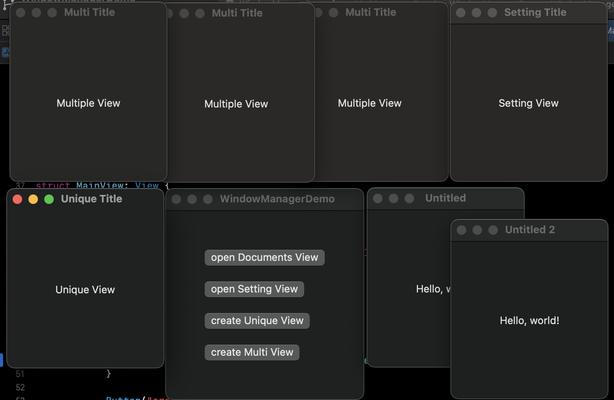

# WindowManager
macOS swiftUI manager window's life cycle

### Usage
```swift
// open DocumentsView
WindowUtil.makeWindow(MyDocumentsView.self, viewType: .document)

// open SettingsView
WindowUtil.makeWindow(SettingsView.self, viewType: .setting)

// create unique without WindowGroup
WindowUtil.makeWindow(UniqueView())

// create multiple without WindowGroup
WindowUtil.makeWindow(MultiView(), allowMultiple: true)


// handleExternals
WindowGroup {
    MainView()
        .handlesExternal()
}
.handlesExternal(MainView.self)

DocumentGroup(newDocument: MyDocuments()) { file in
    MyDocumentsView()
        .environmentObject(file.document)
        .handlesExternal()
}
.handlesExternal(MyDocumentsView.self)


Settings {
    SettingsView()
        .handlesExternal()
}
.handlesExternal(SettingsView.self)

```

